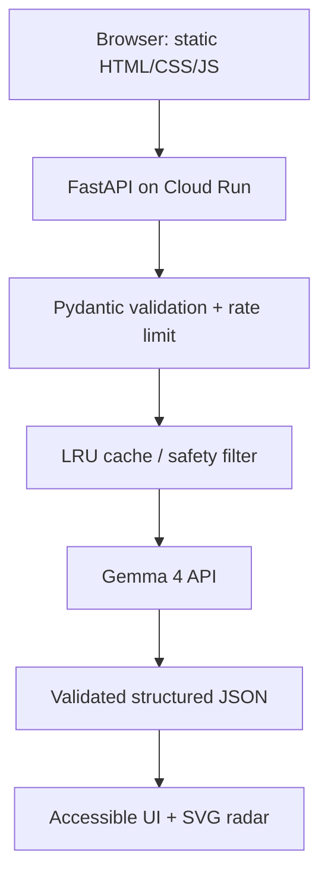

# The Blind Spot


An AI reasoning-reflection tool. You describe a decision; Gemma 4 surfaces hidden assumptions, overlooked factors, internal tensions and Socratic questions, and shows an eight-dimension coverage radar.

## Never-decides principle
The tool never decides, recommends, ranks or implies a winner. Three layers enforce this:
1. **Prompt** – the Gemma 4 system prompt (`app/prompts.py`) allows only restating, assumptions, factors, conflicts and open questions.
2. **Validation** – `app/safety.py` detects directive language ("you should", "I recommend", "best choice"...). Output is retried once, then offending items are stripped.
3. **UI** – a persistent banner: **This tool never decides for you.**

## Architecture


## Scoring criteria
| Criterion | How it is addressed |
|---|---|
| Code quality | Small typed modules, docstrings, Ruff config, no frameworks on the frontend |
| Security | See Security design |
| Efficiency | 1 Gemma 4 call per round (max 2/session), LRU cache, timeout, gzip, async endpoints |
| Testing | pytest + pytest-cov, Gemma 4 always mocked, CI on every push |
| Accessibility | See Accessibility design |
| Problem alignment | Surfaces blind spots only; the no-verdict rule is enforced in three layers |
| Google services | Gemma API, Cloud Run, Google Fonts, Cloud Logging |

## Features / flow
Guided form (+ Load example) → Round 1 analysis → coverage radar + data table → assumption stress test with live "% resting on unverified ground" → optional answers to 2–3 questions → Round 2 (before/after overlaid radar) → "Questions to take with you" (copy / print).

## Structure
`app/` (config, schemas, prompts, gemini_client, safety, cache, routes, main) · `static/` (index.html, styles.css, app.js, radar.js) · `tests/` · `Dockerfile` · `.github/workflows/ci.yml`

## Local setup
```bash
python -m venv .venv && source .venv/bin/activate
pip install -r requirements.txt
cp .env.example .env   # set GEMMA4_API_KEY, then export it (e.g. set -a; source .env; set +a)
uvicorn app.main:app --reload
curl http://localhost:8000/health   # smoke test -> {"status":"healthy"}
```

## Environment variables
| Name | Default | Notes |
|---|---|---|
| `GEMMA4_API_KEY` | – | Required. Only read from the environment; never committed |
| `GEMMA4_MODEL` | `gemma 4` | |
| `PORT` | `8080` | Set by Cloud Run |

## Tests and coverage
```bash
pytest --cov=app --cov-report=term-missing
```
Current: 18 tests, 93% coverage on `app/`. CI prints the percentage on every push.

## Docker
```bash
docker build -t blind-spot .
docker run -p 8080:8080 -e GEMMA4_API_KEY=... blind-spot
```
The container runs as non-root user `appuser`.

## Cloud Run
```bash
gcloud run deploy blind-spot --source . --region REGION \
  --set-env-vars GEMMA_MODEL=gemma 4 \
  --set-secrets GEMMA_API_KEY=gemma-api-key:latest \
  --allow-unauthenticated
```
### Secret Manager
```bash
printf '%s' "$KEY" | gcloud secrets create gemma4-api-key --data-file=-
gcloud secrets add-iam-policy-binding gemma4-api-key \
  --member="serviceAccount:PROJECT_NUMBER-compute@developer.gserviceaccount.com" \
  --role=roles/secretmanager.secretAccessor
```
Alternatively pass a plain runtime variable with `--set-env-vars GEMMA4_API_KEY=...` (less safe).

## Google services
Gemma 4 API (analysis, structured JSON) · Cloud Run (hosting) · Google Fonts (Inter) · Cloud Logging (JSON logs on stdout). Firestore history is not implemented.

## Security design
Pydantic trimming, required-field and max-length checks; 64 KB payload cap; per-IP in-memory rate limiting on AI endpoints; user text sent only inside a delimited `<user_data>` block that the system prompt declares untrusted; schema-validated Gemini output with one retry; CSP, `X-Content-Type-Options`, `X-Frame-Options`, `Referrer-Policy`; empty CORS allow-list; generic error messages (no stack traces); frontend renders with `textContent` only; non-root container; secrets via env/Secret Manager.

## Accessibility design
Semantic header/nav/main/footer, skip link, one `h1`, visible labels with `aria-describedby` helper/error text, keyboard-operable controls with visible focus, `aria-live` status and results, `role="alert"` errors, light/dark themes with high contrast, reduced-motion support, responsive layout. The radar has an SVG label, numeric scores printed on each axis label, dashed vs solid outlines for before/after, and a full data table.

## Assumptions and limitations
- Rate limiting and cache are per instance, so they reset on restart and are not shared across Cloud Run instances.
- Round 1 is cached by input, so identical inputs give identical results.
- "Max 2 calls/session" holds by design (one call per round) but is not enforced server-side, since there are no server sessions.
- Coverage scores are the model's estimates, not measurements.
- The regex filter catches common directive phrasing, not every possible implication.
- Contrast ratios and layout at 320px were chosen deliberately but not audited with a tool.
- Replace `OWNER/REPO` in the CI badge.

## Submission description
The Blind Spot is an AI reflection tool that never makes your decision. You describe a choice, and Gemini surfaces hidden assumptions, overlooked factors, internal tensions and open Socratic questions, scored on an eight-dimension coverage radar. You can stress-test each assumption, answer a few questions, and see how your thinking shifted on a before/after radar. A three-layer no-verdict guard (prompt, validation, UI) keeps it honest. Built with FastAPI, Gemma 4, and Cloud Run; secure, tested, and WCAG-minded.
